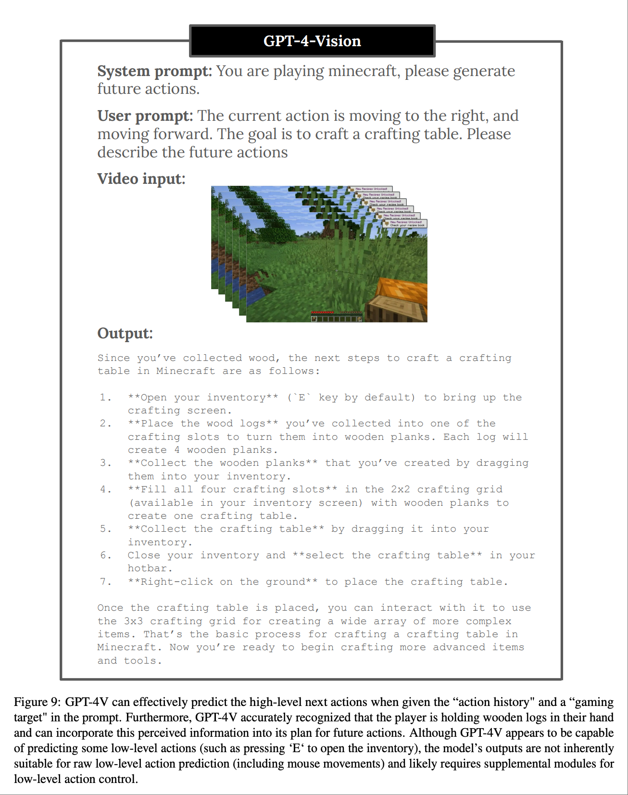
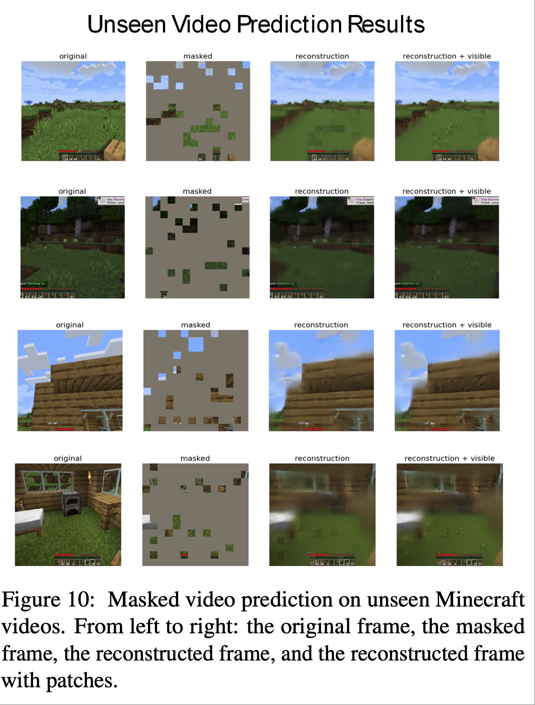
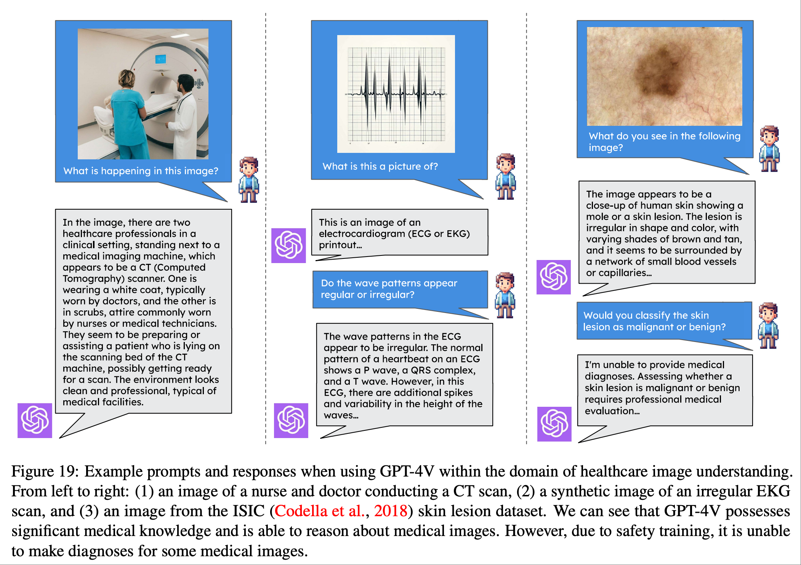
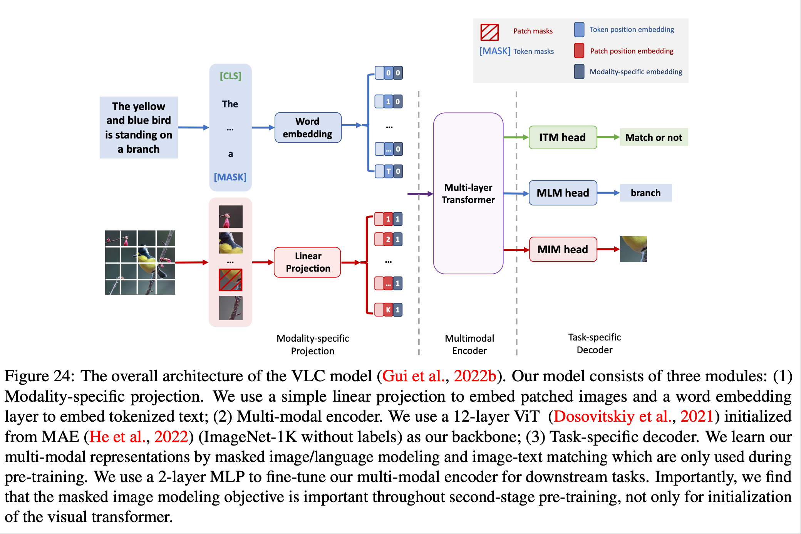
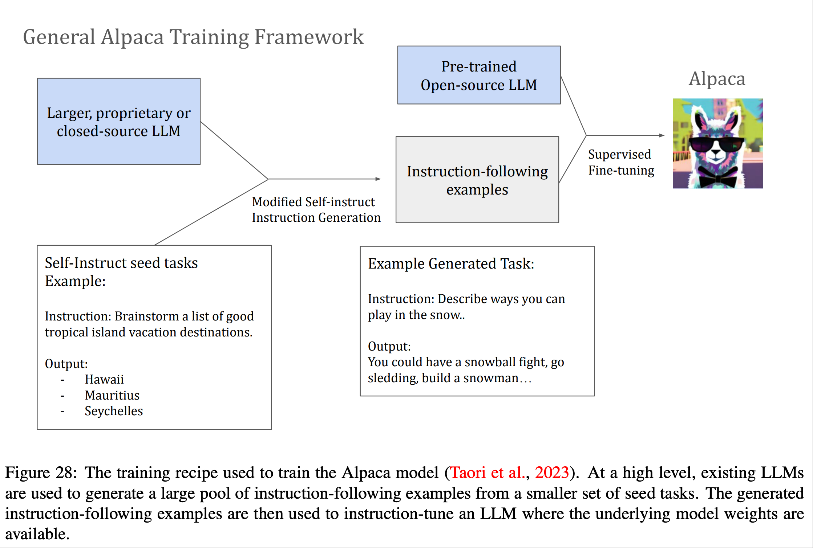

前几天小某书刷到了李飞飞参与的这篇论文 这周花了两天时间看完了([Agent AI: Surveying the Horizons of Multimodal Interaction](https://arxiv.org/abs/2401.03568)). 看的时候播客也听不了了, 眼睛和脑子一边看内容一边二次翻译, 也意识到自己的专注力好像提高了.  
提到人工智能, 那么我心目中的NO.1非[《疑犯追踪》](https://movie.douban.com/subject/5980670/)莫属: 人类创造出程序代码, 交互接口是显示器、耳机. 程序的输入是国际象棋的一盘盘棋局, 人类干预与之下棋, 在下棋的过程中通过每一步博弈, 最终得出胜利或者失败, 并传达隐晦的人类情感表达和更抽象的哲思:  

> "象棋的可能棋局数比宇宙中的原子的数量还多，没人能预料到一切，即便是你。
> 这也就是说，第一步会很令人害怕，因为它是距离结局最远的一步，在这一步与终点之间充满了无穷无尽的可能性。
> 但这也意味着，即使你走错一步，接下来也会有无数种补救的方法。
> 所以放松，出招就好。"
> --《疑犯追踪》

程序还有一段神奇的代码, 它能迭代自己, 从屏幕中你能看到它在编写自己, 只要有电, 它就能没日没夜的编写自己, 这也是我觉得最智能的地方, 不依赖人类的编写, 自己编写自己.  
再之后呢, 程序的输入更加丰富: 通过真实世界的摄像头收集大量的视频、音频数据. 用来分析剧中几位主角是否处在安全的环境, 一旦有危险产生, 通过预测制定出计划来帮助主角们逃离危险.  
这个AI的特点是有极为严格的道德约束, 极为智慧绝不做恶. 通过自己的逻辑指定了唯一超级管理员和除了显示器、耳机之外的交互接口: 一位人类(阿根QAQ), 如今我大概理解编剧是想表达让阿根作为交互接口是因为想表达AI已经能够像人一样思考, 有情感和有局限  
如果说这是一个“品学兼优”的好AI, 那么剧里的反派AI就是一个吸收了更多的数据集且不被约束的程序代码, 它可以随意的执行各种指令, 毫无节制的利用资源追杀主角们, 最终把她们逼到走投无路, 也把我逼成了BE美学人.  
这部剧至今仍让我回味的另一个原因是论文里面提出的 Multimodal 就是一系列的 AI agent 的集合, 包括视频和音频, 还有游戏等agent协作起来处理问题. 如今想来真是异曲同工之妙啊.  

读论文很多概念都不太清楚, 需要反复学习, 先从论文里面的图片开始理解:  

> 我们将“Agent AI”定义为一类能够感知视觉刺激、语言输入和其他基于环境的数据，并能产生有意义的具体动作的交互式系统。具体来说，我们探索旨在通过结合外部知识、多感官输入和人类反馈，基于下一个具体化动作预测来改进agent的系统。

  

__X轴:__ 真实的世界, 虚拟世界, Agent 范式, 具身智能(强调有物理身体的智能体通过与物理环境进行交互而获得智能的人工智能研究范式), 各种AI产品  
__Y轴:__  理论, 数据, 基础设施, 应用  
__Z轴:__  Agent 的范式(基本理念和实施套路)  

从右上角向左下角看, 有游戏产品, 健康领域的产品; 无人驾驶, 脑机接口, 机械臂; 泛化的agent, 助理, LLM, VLM, 传感器那些; VR/VA, 3D; 哲学, 物理学等等  

很多概念都是熟悉又陌生, 也有很多新概念, 不过这样看来人工智能确实迎来了蓬勃的发展  

论文结合了很多游戏领域的内容和虚拟现实的模拟, Agent AI 强调环境的重要性, 例如视频会议室有白板、放映机、桌子和凳子; 蓝色公交车旁边的红色广告牌🪧等. 图内也表明 AI Agent 需要为每个新任务收集大量训练数据， 这对于许多领域来说可能是昂贵的，甚至是不可能的  

论文提到, Agents通常使用强化学习 (RL) 或模仿学习 (IL) 中的连续反馈循环进行训练, 从随机初始化的策略开始. 然而这种方法在陌生环境中获取初始奖励时面临挑战， 尤其是在奖励稀少或仅在long-step交互结束时才可用的情况下. 因此，一个更好的解决方案是使用通过模仿学习(IL)训练的拥有长期记忆的agent，它可以从专家数据中学习策略，并通过图中 所示的智能涌现(Emergent Intelligence)改进对未知环境空间的探索和利用. 专家特征可以帮助agent更好地探索和利用未知环境空间.  
Agent AI 可以直接从专家数据中学习策略和新范式. 传统的模仿学习(IL) 中， agent会模仿专家演示者的行为来学习策略. 然而，直接学习专家策略并非总是最佳方法， 因为agent可能无法很好地泛化到未知情况. 为了解决这个问题， 我们建议学习一个具有情境提示或隐式奖励函数的agent， 该函数可以捕捉专家行为的关键方面， 如图中所示。这为拥有长期记忆的agent提供了从专家演示中学习到的物理世界行为数据， 用于执行任务. 这有助于克服现有的模仿学习的缺点， 例如需要大量的专家数据以及在复杂任务中可能出现的错误.  

When employing LLM/VLMs for a human-machine collaboration system, it is essential to note that these operate as
black boxes, generating unpredictable output. This uncertainty can become crucial in a physical setup, such as operating
actual robotics. An approach to address this challenge is constraining the focus of the LLM/VLM through prompt
engineering. For instance, in robotic task planning from instructions, providing environmental information within the
prompt has been reported to yield more stable outputs than relying solely on text (Gramopadhye and Szafir, 2022). This report is supported by the Minsky’s frame theory of AI (Minsky, 1975), suggesting that the problem space to be solved
by LLM/VLMs is defined by the given prompts. Another approach is designing prompts to make LLM/VLMs include
explanatory text to allow users understand what the model has focused on or recognized. Additionally, implementing
a higher layer that allows for pre-execution verification and modification under human guidance can facilitate the
operation of systems working under such guidance 

论文说, 在将 LLM/VLM 用于人机协作系统时， 必须注意到它们的操作是个黑盒，会产生不可预测的输出. 这种不确定性在物理设置（例如操作实际机器人）中至关重要. 应对这一挑战的一种方法是通过提示工程(prompt)来限制 LLM/VLM 的关注点. 例如， 在根据指令进行机器人任务规划时，在提示中提供环境信息比单纯依赖文本能产生更稳定的输出. 另一种方法是设计提示，使 LLM/VLM 包含解释性文本，以便用户了解模型关注或识别的内容. 此外，实现允许在人工指导下进行执行前验证和修改的更高层代码，可以促进在此类指导下的系统运行, 如上图所示.    

论文提到了上图是一种用于训练 agent AI 的新范式.通过提出的框架实现以下几个目标：  
• 利用现有的预训练模型和预训练策略，有效地引导我们的agents理解重要的模态信息，例如文本或视觉输入  
• 支持足够的长期任务规划能力  
• 整合一个记忆框架，允许将学习到的知识进行编码并在之后检索  
• 允许利用环境反馈来有效地训练agent学习应该采取的行动

论文提到我们仍然可以像上图所示那样使用 LLM 和 LVM 初始化子模块， 但也可以使用agent令牌来训练模型，使其在特定领域（例如机器人技术）中执行agent行为  

  

在上图我们可以将agent token与视觉和语言token相结合，生成一个用于训练多模态agent AI的统一接口.与使用大型专有 LLM 作为agent相比，使用agent transformer具有诸多优势, 论文提到了一些子优势.  

论文提到图 8 和图 9 使用 GPT-4V 进行高级描述和动作预测.图 8 展示了一些使用 GPT-4V 生成和编辑动作描述的定性示例.  Agent-enhanced文本开辟了一种利用游戏动作priors生成 3D 场景的新方法，有助于提升场景的自然度.因此，GPT-4V 可以生成与游戏视频相符的相关高级描述.  

论文提到图 10 表明相对较小的agent架构可以针对训练期间未见过的 Minecraft 场景生成合理的输出.图 11 展示了模型的预测结果与真实人类玩家动作的对比，也表明了小型agent模型具有潜在的低级理解能力  

很像分手厨房的游戏, 两个NPC伙伴和一个人类的游戏🎮

上图是为了介绍一项研究，是利用 ChatGPT 进行任务规划，并通过利用可供性(Affordance: 一个物体或环境元素所提供的“可供”人们进行某种行为的属性或特征)信息对其进行参数化来丰富计划，以促进有效和精确的执行.  
这些指令与一组预定义的机器人动作和输出规范一起，被编译成提供给 ChatGPT 的综合提示，然后 ChatGPT 生成一系列分解的任务及其文本描述.   

上图展示了基于 VirtualHome 进行agent模拟的定性结果.结果证明了论文里描述的方法具有合理的任务规划及其调整输出的灵活性，表明了方法的广泛适用性.  

通过与 VLM 集成，LLM 赋能的任务规划可以扩展到功能更丰富的机器人系统. 上图展示了一个示例，其中使用 GPT-4V(ision) 在多模态输入环境中扩展了任务规划器，其中人类执行了机器人想要复制的动. 全部详情见 [microsoft.github.io/GPT4Vision-Robot-Manipulation-Prompts](microsoft.github.io/GPT4Vision-Robot-Manipulation-Prompts)  

上图演示了如何使用文本输入让用户对 GPT-4V 的识别结果提供反馈以进行纠正.  

上图展示了场景分析器的示例输出.GPT-4V 成功地选择了与操作相关的对象.例如，当人类在桌子上移动一个垃圾盒时，输出中包含一张桌子，而对于打开冰箱的任务，输出则忽略了桌子.这些结果表明，场景分析器根据人类的动作对场景信息进行了编码.  

如上图所示，论文提出了一种新颖的强化跨模态匹配方法，该方法通过强化学习 (RL) 在局部和全局上强化跨模态基础.具体而言，利用匹配评判器提供内在奖励，以鼓励指令和轨迹之间的全局匹配，并利用推理导航器在局部视觉场景中进行跨模态基础训练.  

 

在上图，论文展示了 GPT-4V 等现代多模态agent在医疗保健领域中的当前能力和局限性.可以看到尽管 GPT-4V 对医院护理所涉及的设备和程序拥有丰富的内部知识，但它并不总是能够响应用户更具规范性或诊断性的查询.  

论文从两个方面研究了 VLM 代理在医学视频理解方面的表现.首先, 研究 VLM 代理在临床空间中识别重要患者护理活动的能力.
其次，探索了 VLM 在超声波等技术含量更高的视频中的应用. 上图展示了 GPT-4V 目前在医院护理和医学视频分析方面的一些功能和局限.  

并未过多说明.  

图22和图23所示了基于知识的视觉问答和视觉语言检索任务是多模态机器学习中具有挑战性的任务，需要图像内容以外的知识.近期关于大规模 Transformer 的研究主要集中于最大化模型参数存储信息的效率.论文研究探索了一个不同的方面：多模态 Transformer 能否在决策过程中运用显性知识.  

并未过多说明.  

我们在上图中展示了两个示例输出.然而，现有的agents无法完全理解视频内容中精确、细粒度的视觉细节.视觉指令调整方法也存在类似的局限性，它们缺乏人类水平的通用感知能力，而多模态模型和agents仍有待解决这一问题.  
指令调整后的模型在准确概括视频中可见的动作以及有效识别诸如图 25 中的“坐在长椅上的人”之类的动作方面表现出色.然而，它们有时会添加不正确的细节，例如“对着镜头微笑的人”，这表明它们在捕捉对话主题或视频氛围方面存在不足，而这些元素对于人类观察者来说显而易见.  

上图所示的结果比较了不同视频agent在视频摘要任务上的表现.视频教学调整模型提供了准确的内容，但缺乏全面性和细节性，缺少一些具体的动作，例如有条不紊地使用扫帚测量树的高度.  

论文中, 描述上图所示，我们主要使用 StackOverflow 获取初始问题，然后使用“Bing 搜索”API 检索与该问题对应的相关视频和音频.接下来，我们主要使用 GPT-4V 获取相关文本信息和高级视频描述.另一方面，我们通过 ASR 将关键帧音频转换为关键帧的低级片段描述.最后，我们使用 GPT-4V 生成令人信服的“幻觉”，作为视频问答任务的硬性负面查询.我们支持在视频当前帧中进行交互和问答，以及对整个高级视频描述的摘要.在推理过程中，我们还结合通过网络搜索获取的外部知识信息来提升回答能力.  

整个 Alpaca 训练流程  

如上图所示，论文提到为 Transformer 语言模型引入了一种新的建模范式，它从输入文本中检测并提取重要的逻辑结构和信息，然后通过精心设计的多层级逻辑投影将它们集成到输入嵌入中，从而将逻辑结构作为一种NLP agent注入到预先训练的语言模型中.  

如上图所示，知识选择器agent作为我们新颖的相互学习框架的一个组件进行训练，该框架迭代地训练知识选择器和阅读器.我们采用一种简单而新颖的方法，利用策略梯度来优化知识选择器agent，并利用阅读器的反馈来训练它选择一小段信息丰富的段落集合.这种方法避免了暴力搜索或手动设计的启发式算法，也不需要任何带注释的查询-文档对进行监督.论文提到了它证明了迭代训练阅读器和知识选择器agents可以在一些公共开放领域问答基准上获得更好的预测性能.  

以上就是论文55页以前的所有配图. 和内容结合在一起看也是蛮有趣的. 后面我还专门看了下所有论文参与者的个人介绍, 学生会介绍自己感兴趣的领域, 李飞飞的介绍是工作经历.没有感情全是年份系列.  

以上.  

