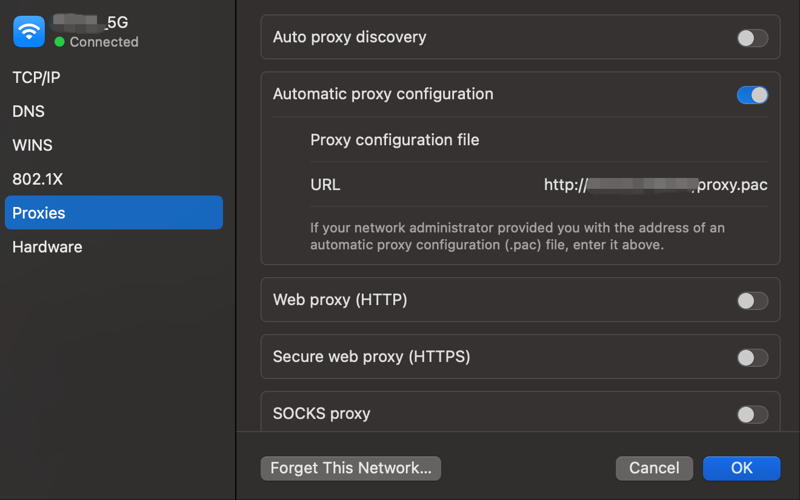
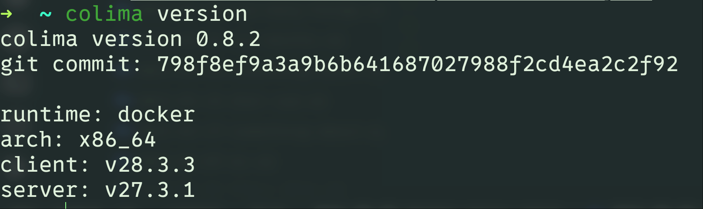
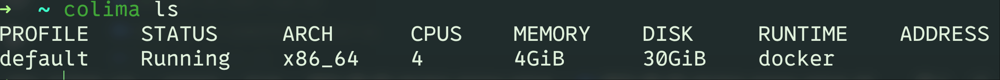
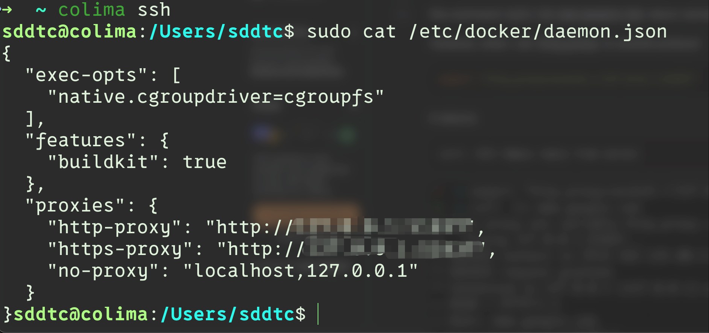

虽然 docker desktop app 个人免费有友好的 UI 界面, 下载 images 也很快, 但是当重新配置 CPU 和 memory 的时候, 一旦运行一些 container 造成卡顿电脑很容易变慢且无响应.
再加上个人更喜欢命令行模式, 于是还是解决了之前 colima+docker 无法下载 docker images 的问题.

已经具备的前提条件:
* VPN(SS) + Trojan-Qt5(client)
* [colima](https://github.com/abiosoft/colima): 一款开源的 docker desktop app 平替
  * 需要额外安装qemu(和colima template的默认配置相关 **vmType: qemu**)
    * [brew install qemu](https://formulae.brew.sh/formula/qemu)
  * 需要额外安装docker
    * [brew install docker](https://formulae.brew.sh/formula/docker)

本机的 VPN 采用的是动态寻址(proxy.pac), 有个白名单定义了哪些网址走 VPN, 所以 docker images 下载访问失败是因为需要走这个代理但是没有配置过(说到底是因为docker.io和docker.com咱们访问不了🙂):

安装之后的colima版本:

安装好了之后就该配置 docker proxy 了.我采用了动态修改 docker container 配置的形式.除此之外还有其他方法,因为没有使用就不在此介绍了.
关于 colima 启动 docker 虚拟机的时候, 这次我也利用了 `colima template` 进行了自定义模版, 当你创建成功一个 default virtual 的时候, 模版文件地址就在
`/Users/sddtc/.colima/default/colima.yaml`(将sddtc替换为你的用户名)

如图所示, default 的虚拟机架构是 x86_64, 配置了 4 个 CPU,内存给了 4G, 硬盘分配了 30G, 运行时是 docker.而我本机配置是 Mac(Intel Core i7+16G内存+500G),所以 docker 的配置突出一个够用就行.
配置 docker proxy 其实是为了配置`/etc/docker/daemon.json`中的 **proxies** 节点:
```json
"proxies": {
    "http-proxy": "http://<url>:<port>",
    "https-proxy": "http://<url>:<port>",
    "no-proxy": "localhost,127.0.0.1"
  }
```
url, port 就是你 VPN 所配置的地址和端口号. 基本上本机代理的 url 就是 127.0.0.1. 这里有个坑就是协议(这里使用的是http而不能是socks5). 不过这个坑应该只有使用 VPN(SS) + Trojan-Qt5(client)
会遇到:  
* [stackoverflow: why socks5 protocol in http_proxy lead "curl: (52) Empty reply from server"?](https://stackoverflow.com/questions/73798733/why-socks5-protocol-in-http-proxy-lead-curl-52-empty-reply-from-server)    

为了到达配置 docker proxy 的目的,我在 `/Users/sddtc/.colima/default/colima.yaml` 的 **env** 节点下配置 proxy (应该也可以配置在 docker 节点下, 我也是用了其中一种方法):  
```json
env:
  http_proxy: http://<url>:<port>,
  https_proxy: http://<url>:<port>,
  no_proxy: "localhost,127.0.0.1"
```
template 写好之后,启动/重新启动 colima: `colima start`/`colima restart`
接着使用 `colima ssh` 进入到虚拟机内部:  

这里你会发现url会被重写为 `192.168.5.2`, 这是 colima 的一个 issue(最新版0.8.2也没有修复), 见
* [Colima does not auto-replace gateway address for proxy variables in docker daemon.json](https://github.com/abiosoft/colima/issues/1144)
* [colima x86_64 daemon.json file has incorrect proxy](https://github.com/abiosoft/colima/issues/956)  

评论提到可以使用provision脚本更新, 但是我发现我的 template 并没有在重启后自动执行脚本, 于是可以手动执行修复:

```shell
colima ssh
cat /etc/docker/daemon.json # 检查一下proxies的值
sudo sed -i "s/192.168.5.2/127.0.0.1/" /etc/docker/daemon. #我是本机代理所以是127.0.0.1
sudo systemctl daemon-reload
sudo systemctl reload docker
exit
```

这样一配就好了.  
如果你用了类似 iTerm2 的命令行工具, 会需要 run `docker login` 等命令, 同样需要命令行工具在访问某些网站时使用代理,可以在 `~/.zshrc` 配置一下子:
```shell
# setup proxy can turn on/off then iTerms can also use proxy to visit google
alias proxy="export all_proxy=http://<url>:<port>"
alias unproxy="unset all_proxy"

source ~/.zshrc
```

需要走代理的时候运行下 proxy, 不需要走代理运行下 unproxy.  

一切都配置好了, 正常pull images, 搞定.
