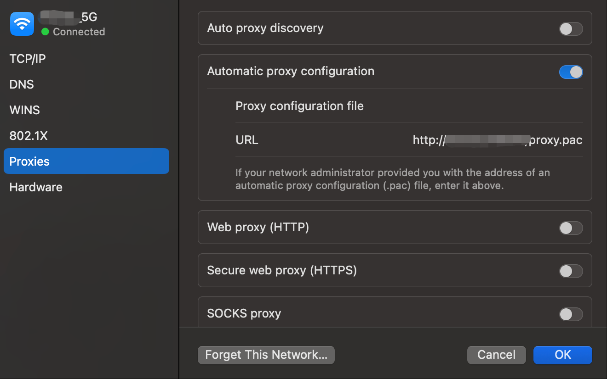
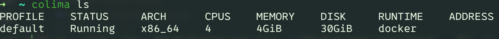
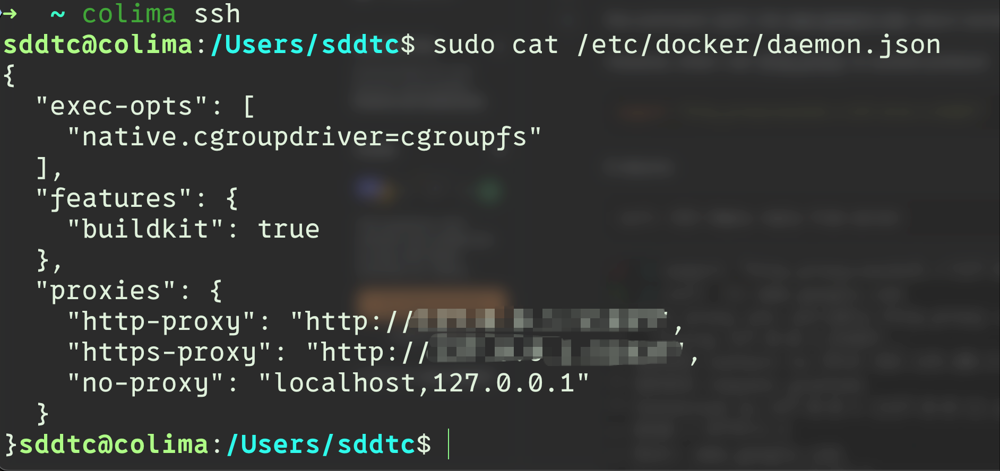
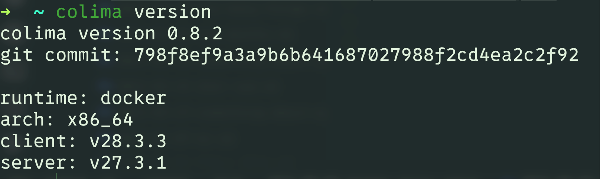

### 碎碎念:  
虽然 docker desktop app 个人免费, 有友好的 UI 界面且下载 images 也很快, 但是当重新配置 CPU 和 memory 的时候, 一旦运行一些 container 会经常造成卡顿, 导致我的电脑很容易无响应. 再加上个人觉得命令行模式简单易用, 于是克服了之前 colima+docker 无法下载 docker images 的问题. 本文详细介绍了解决方案.  

## 确保你已经具备的前提条件:
* VPN(SS) + Trojan-Qt5(client)
* [colima](https://github.com/abiosoft/colima): 一款开源的 docker desktop app 平替
  * 需要额外安装qemu(和colima template的默认配置相关 **vmType: qemu**): [brew install qemu](https://formulae.brew.sh/formula/qemu)
  * 需要额外安装docker: [brew install docker](https://formulae.brew.sh/formula/docker)

## 配置WIFI 的 VPN proxy.pac 
如果你的 VPN 采用的是动态寻址(proxy.pac) - 有个白名单定义了哪些网址走 VPN, 哪些不走.  
那么如果没有为WIFI配置代理, 下载 docker images 会访问失败(说到底是因为docker.io和docker.com在某些区域被限制访问🙂), 如图所示, 确保打开 Automatic proxy configuration, 在 URL 配置 proxy.pac:  


## 定义 Colima 默认 Docker
笔者采用动态修改 docker container 配置的策略.  
colima 启动 docker 虚拟机的时候, 利用 `colima template` 进行了自定义模版, 模版文件地址:  
`/Users/sddtc/.colima/default/colima.yaml`(将sddtc替换为你的用户名)

配置文件的内容如上图所示:
* 虚拟机架构是 x86_64
* 配置 4 个 CPU
* 内存 4G
* 硬盘 30G
* 运行时是 docker  

而我本机配置是 Mac(Intel Core i7+16G内存+500G), 所以 docker 的配置突出一个够用就行.
## 配置 Docker proxies
proxies 的位置在 Docker 虚拟机的`/etc/docker/daemon.json`的**proxies**节点:
```json
"proxies": {
    "http-proxy": "http://<url>:<port>",
    "https-proxy": "http://<url>:<port>",
    "no-proxy": "localhost,127.0.0.1"
  }
```
其中:  
* `<url>`: VPN 所配置的地址. 基本上本机代理的 url 就是`127.0.0.1`. 这里有个坑就是协议(这里使用的是http而不能是socks5). 不过这个坑应该只有使用 VPN(SS) + Trojan-Qt5(client)
会遇到: [stackoverflow: why socks5 protocol in http_proxy lead "curl: (52) Empty reply from server"?](https://stackoverflow.com/questions/73798733/why-socks5-protocol-in-http-proxy-lead-curl-52-empty-reply-from-server)
* `<port>`: VPN 所配置的端口号.   

该配置在你把colima的Docker删除再新创建的时候会被清除, 因此要在`/Users/sddtc/.colima/default/colima.yaml` 的 **env** 节点下也配置 proxy 好:  
```json
env:
  http_proxy: http://<url>:<port>,
  https_proxy: http://<url>:<port>,
  no_proxy: "localhost,127.0.0.1"
```
template 写好之后:  
1. 启动/重新启动 colima: `colima start`/`colima restart`
2. 使用 `colima ssh` 进入到虚拟机内部:  


这里你会发现url会被重写为!!!`192.168.5.2`!!!, 这是 colima 的一个 issue(最新版0.8.2也没有修复), 见
* [Colima does not auto-replace gateway address for proxy variables in docker daemon.json](https://github.com/abiosoft/colima/issues/1144)
* [colima x86_64 daemon.json file has incorrect proxy](https://github.com/abiosoft/colima/issues/956)  

查看colima版本:


## 修复 Docker proxy url
手动执行修复(评论提到可以使用provision脚本更新, 但我发现 template 并没有在重启后自动执行脚本):

```shell
colima ssh
# 检查一下proxies的值
cat /etc/docker/daemon.json 
#我是本机代理所以是127.0.0.1
sudo sed -i "s/192.168.5.2/127.0.0.1/" /etc/docker/daemon.json
sudo systemctl daemon-reload
sudo systemctl reload docker
exit
```

这样一配就好了. 
## iTerm2 配置 proxy 开关 
如果你用了类似 iTerm2 的命令行工具, 会需要 run `docker login` 等命令, 同样需要命令行工具在访问某些网站时使用代理,可以在 `~/.zshrc` 配置一下子:
```shell
# setup proxy can turn on/off then iTerms can also use proxy to visit google
alias proxy="export all_proxy=http://<url>:<port>"
alias unproxy="unset all_proxy"

source ~/.zshrc
```

需要走代理的时候运行下 proxy, 不需要走代理运行下 unproxy.  

一切都配置好了, 正常pull images, 搞定.